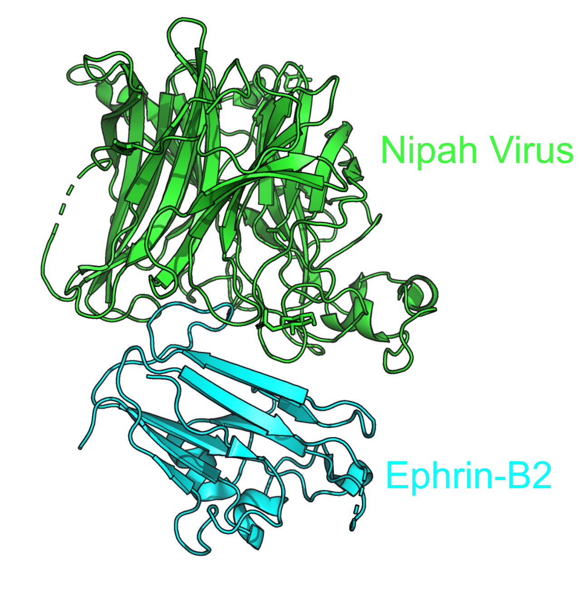
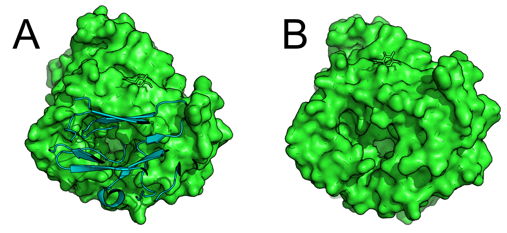
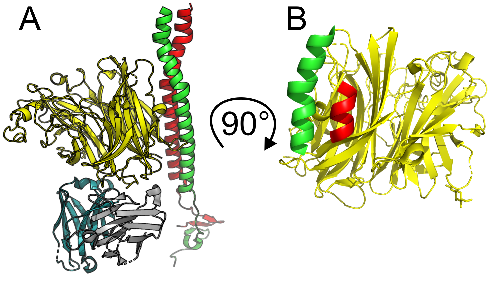
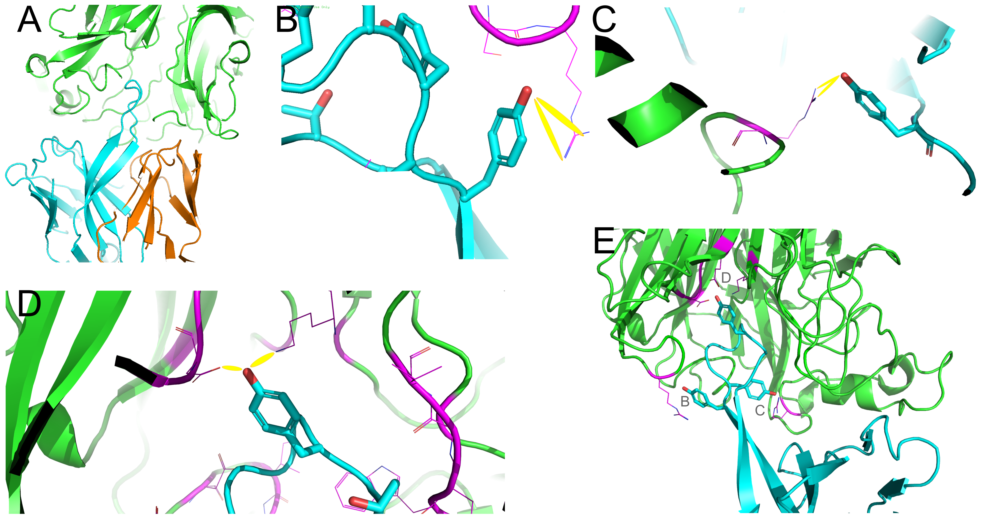
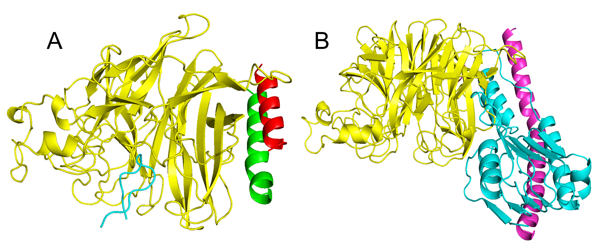
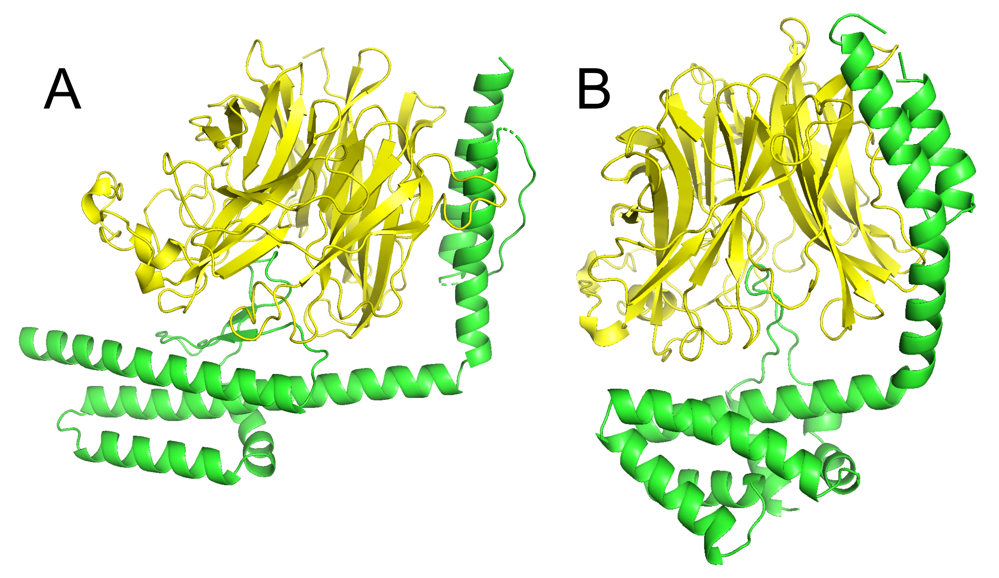
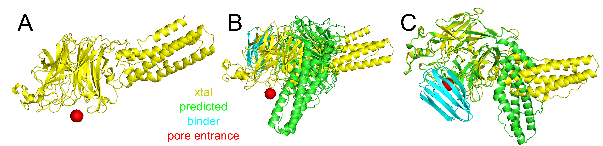
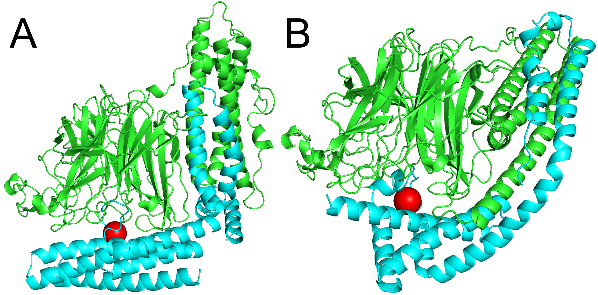

## Introduction

First and foremost, this was a team effort; I would like to not only acknowledge but equally share this effort with both Dr. Christopher D. Snow and (soon to be Dr.) Ashlyn Chen. I had reached out to Chris asking if he had any interest in competing in this competition, and if so would he be willing to donate some computational resources to the endevour. Not only did he agree, he ran several of his own designs that placed in my submitted top 10. A huge thank you to both of them for their time, energy, and scientific insights.

## What is this?
Recently, there was a call for protein binders against the nipah virus G-protein (I will refer to this as just "nipah virus" from here on out) due to its high lethality and recently the WHO listed it as a top-priority for vaccine development. It binds very tightly to the Ephrin B2 and B3 receptors. For more, please see their write up and call here: https://proteinbase.com/competitions/adaptyv-nipah-competition .

This page serves to document my efforts and how I tackled this problem. It also serves as a place to point to when discussing workflows and budding scientists to when talking about how I tackle things. This is an extremely informal white paper on how I approached the problem.

## Structural investigation
It's always worth starting these with both an investigation of the structure, as well as a releveant literature search. The competition gave us a starting structure for us to investigate, 2vsm, a complex of the nipah virus and the human cell surface receptor, Ephrin-B2. 

The binding interaction sits on the pore of the beta (B-) propeller, and reaches up into the pore, creating a strong "double interaction" - a surface to sit on (top half of the B-barrel) and a loop to reach up into the B-propeller and grab onto several charged residues. Looking at the surface representation of the nipah virus lets us easily identify the Ephrin-B2 burying into the pore (__A__), as well as observe the pore itself (__B__). This insight gives us a good idea of the regions to target when we inevitably make our own, competitive binder. 

After a literature search, I identified several structures that might give additional insight into binding of the pore, or adjacent to the pore. Namely, these are structures 7ty0 and 8k0d. 7ty0 has a system of doubled coils (__A__) running along the side of the structure (it also has some sort of dimer binder seated near the pore entrance, but I found nothing of substantial interest in it). These coils are very long, but we can somewhat easily isolate the substructure that is making the most contacts both with the nipah virus and with one another (__B__). 

8k0d is a macaca antibody with an extremely long CDR loop that reaches far into the pocket of the nipah virus (__A__). There are a handful of interactions that are very important; here I am highlighting the side chain interactions. We have two tyrosines pinning the bottom of the loop creating strong hydrogen interactions with the nipah virus (__B, C__). While there are other, less strong contacts that occur in the structure, these two coupled with the tyrosine at the very tip of the loop (creating 3 favorable contacts, __D__) make up a majority of the side chain interactions in the loop. There are a handful of other interactions with side chains from the nipah virus interacting with the backbone of the long loop, further reinforcing the interactions made by this loop are favorable enough to splice together into a motif. Finally, a shot of the heavy chain with all 3 previously mentioned residue interactions are shown in (__E__). 

## Actual computational design
### BoltzGen
Both BoltzGen (https://github.com/HannesStark/boltzgen) and BindCraft (https://github.com/martinpacesa/BindCraft) have made binder design exceptionally easy. As the new kid on the block, I decided to experiment using BoltzGen the most. I ran 4 different "modes" of BoltzGen: 
  - free design (no motif, no hotspots/binding site)
  - motif grafting (include a motif, no hot spots/binding site)
  - free design with hot spots (no motif, specify residues that are important for binding)
  - motif grafting with hot spots (specify a motif and specific residues that designed binder should interact with).

This was pretty straight forward to do in BoltzGen; for the hot spots I selected a few residues that played a key role in binding to the Ephrin-B2 or the macaca antibody. For example, picking the two arginines that make favorable hyodrgen bonds with the two tyrosines (__B, C__) are great hot spot residues because they are right at the entrance to the pore, and could easily act as sites for the designed binder to interact with. The only thing that didn't work in BoltzGen was trying to graft multiple protein structures together. For example, when trying to graft both of the coils together and the long loop (__A__), BoltzGen wound up making 2 binders instead of just 1 (__B__). I did ask for help in the BoltzGen slack channel but unfortunately was not answered. At this time, I do not think BoltzGen is capable of doing more complex grafting tasks like this. In theory, what I wanted to do, was be able to design say 50 residues on the N terminus of the loop that made good contact with the pore of the nipah virus (cyan, __A__), then design 75 residues between the loop and one of the coils (red or green, __A__), then a short 12AA linker between the two coils, then pick up the other coil (red or green, but not the first coil color selected, __A__), and then finally design another 50 residues on the tail end to give the binder some flexibility in its shape. BoltzGen instead was broke this request up into multiple pieces and ultimately generated 2 binders from the 3 pieces, instead of just 1. This did work for simpler designs (for example, grabbing only the long loop and not the coils) just fine. 

 If anyone reading this sees this and wants to take a stab at it, I will happily credit you and your fix should it work! Please check out `examples/boltzgen_failed_multigrafting`, particularly the yaml file is what needs to change.

For doing simple grafting where there is only one protein body of interest you'd like to design a binder with, check out `examples/ boltzgen_simple_grafting`. 

Doing nanobody design via BoltzGen is remarkably simple - just change the protocol from `protein-anything` to `nanobody-anything`. For an example doing nanobody design while simultaneously targeting some specific residues as binding hotspots, check out `examples/boltzgen_nanobody_and_hotspots`. 

In total, we probably ran ~30,000 BoltzGen designs doing all 4 combos. BoltzGen automatically ranks these according to its own filters/metrics. How to decide what to move forward with, specifically for this competition, we'll reinvestigate a bit later. 


### RFDiffusion - ProteinMPNN - Boltz2
Because we couldn't take advantage of designing a binder that "double clamps" the nipah virus (i.e. binds to the pore entrance and the side of the nipah virus) via BoltzGen, I thought it would be interesting to try it with something that can handle more complex motif scaffolding a la RFDiffusion. The idea was pretty simple; tell RFDiffusion the receptor is the nipah virus (chain A), the grab each of the motif pieces in some order that made sense, and design bits of protein as we go along. We can also do this with ranges for lots of flexibility. We can tell RFDiffusion to only design binders between 150-250 residues in length (250 is the maximum allowable length, as set by the competition). Then we can also give ranges for the "designed bits" in between each motif: design 0-120 residues before we grab the macaca loop, grab the macaca loop, design 0-150 residues between the macaca loop and the first coil, grab the first coil, design between 5-30 residues between the first and second coil, grab the second coil, and design 0-30 residues after the second coil. This gives RFDiffusion plenty of opportunity to explore the landscape and find a handful of backbones that are at least somewhat feasilbe. We can tell RFDiffusion a handful of other things that are important, like some hotspots that the designed binder should interface with, and even some diffusion potentials to help influence the general shape of the backbone. Without the diffusion potential over the diffused backbone, the backbones produced (__A__) just looked a little... off. I'm unsure how to describe it other than my experience, my gut was telling me this was an odd structure. It's very possible that I am incorrect in my thinking, and that this wasn't necessary. But I wanted to design something that was a bit more globular (__B__) in nature and didn't stick out quite as far into solution, seemingly unnecessarily. The specific potential used was the radius of gyration; I doubled the strength and applied a quadratic fall off.  See `examples/RFDiffusion_ProteinMPNN_Boltz2/1_RFDiffusion` 

With 2.5k backbones created, next we have to design sequences to these backbones. All that flexibility I was ranting and raving about earlier, in how long the designed binders are and how long each segment is in between? We must now pay the price here in sequence design. This is because we want to keep the sequences of the long macaca loop and the 2 coils fixed, but design the sequence of the protein in between and flanking. Thankfully, this isn't too hard - each designed backbone has a "trajectory" file associated with it (.trb) and it is a pickled filed containing a bunch of information about the design process. Specifically, it stores a mask of whether or not that residue was inpainted or not. This lets us pretty easily come up with a script where we can identify which residues in our binder are inpainted (designed structure via RFDiffusion) or are motif grafted. Once we have this list, we simply pass it to ProteinMPNN and tell it which residues it's allowed to design, and out pops a sequence for us. In this project I generated 4 sequences per backbone, resulting in ~10,000 sequences. See `examples/RFDiffusion_ProteinMPNN_Boltz2/2_ProteinMPNN`.

After running ProteinMPNN with some residues kept fixed, we can generate MSA's via MMseqs2. This is a tricky set up and isn't something I'll be covering in depth here; if you need to, I reccomend building the MMseqs2 binary from scratch. Then get Sergey's ColabFold up and running. This gives us a `colabfold_search` function that inputs the MMseqs2 binary, fasta file, and databases, then generates the MSA's. It is far more efficient to give MMseqs2 one giant fasta file opposite to several little fasta files; I wrote a python script to simplify the fasta headers,  unpair the sequences to generate independent MSA's because this is what Boltz2 expects, and double check that the sequence being added is unique - i.e. no duplicate sequences. See `examples/RFDiffusion_ProteinMPNN_Boltz2/3_MMseqs2`. 

After generating all the sequences and MSA's, we are ready to refold them in Boltz2 to see how the designed binder and the nipah virus interface. Due to the moderate complexity of the input yaml file, I found it easiest to write a script that puts the format of the yaml file in, along with the nipah sequence and nipah MSA, then just changes the binder sequence and matching binder a3m file. With this directory made, we simply call boltz on it and predict their structures with one minor caveat: we must include the `--write_full_pae` flag! boltz doe not, by default, write the full pae matrix out along with the structure. But it is necessary to use the Dunbrack `ipsae.py` script. This means our full command looks something like `boltz predict $input_yaml_dir --write_full_pae`. This will produce a directory called `boltz_results_${input_yaml_dir}`. In it there is a subdir `predictions`, and then one subdir therein for each structure prediction. 

I combine these next 2 ideas into a single step, because it makes the most sense to pair them sequentially per structure. They are:
  - Calculate ipSAE for each structure
  - Determine if the binder is binding in the correct position

One of the things I noticed doing all these experiments is that after refolding many of the targets, they didn't necessarily bind in to the nipah virus in a place that would occlude or sterically hinder the Ephrin-B2/3 from binding to the pore. Thus, some of the binders might have really high ipSAE (indeed, some of my top performers were off-target on the nipah virus) but would still allow Ephrin-B2/3 complexing, thus defeating the whole purpose of the binder. What I did to combat this was pick an atom in the Ephrin-B2 complex by eye that sat at the center entrance of the nipah virus pore (__A__). I converted this to a dummy atom, then asked the question "Does this binder (as predicted by Boltz2) clash with this dummy atom at the entrance to the pore?" This took me quite a while to solve - the gotcha moment was that after aligning the nipah virus structure of my Boltz2 prediction onto the crystal structure with the pore blocking dummy atom, no strucrtures ever sterically occluded - even some of the ones I was looking at by eye (__B__)! Turns out, the "neck" of the nipah virus (first ~175 residues) have a hinge, and are highly mobile. Thus, my default alignment approach (Ca's along the whole protein) was throwing the nipah virus (xtal) | nipah virus (prediction) wildy off by ~10A. After only aligning on residues [175:], my base RMSD was very low (1A), and subsequently I was able to do the occlusion test (__C__) and correctly identify if a binder was correctly positioned. I did this by calculating the distances of the alpha carbons from the dummy atom; if there were 3 Ca's within 6A, then I conidered it a passing binder (significant steric occlusion). 

Many of the RFDiffusion - ProteinMPNN - Boltz2 binders had very large contact surface area with the nipah virus, implying that the "double sided" attack probably has some merit. Change in solvent accessible surface area (often abbreviated as dSASA) is a strong indicator for tighter binders. They also have the long macaca loop reaching far up into the pore of the nipah virus. Both structures had an ipSAE of 0.78 (__A__) and 0.76 (__B__) respectively. If I was truly launching a binder campaign against the nipah virus, I would have upped the number of backbones to closer to ~15k, kept it at 4 sequences per backbone, and folded them all. I would also consider the following metrics in addition to ipSAE, as they have reliably shown to be good indicators of binder classification (is it or is it not a binder) as well as binder strength (tightness of the binder): iPLDDT, dG, dSASA, shape complimentarity (SC). However because this was a quick, for fun experiment and the only metric that matters is ipSAE, then I chose to stop here. 

See `examples/RFDiffusion_ProteinMPNN_Boltz2/4_Boltz2`.

### Reranking of BoltzGen, Protein-Hunter, and BindCraft designs
In order to differentiate and rank, somewhat globally, all the binders designed across all the modalities, I hijacked the last couple of steps in the RFDiffusion - ProteinMPNN - Boltz2 pipeline and reimplemented it. The pipeline is run from a single script in `examples/rerank_any_sequence_ipSAE/boltz2_ipsae_pipeline.sh`. It expects a single csv as input, and at least two of these columns must be `id` and `designed_sequence`. There are a few more input variables that are not as critical, and exist purely to help stay organized.

```
design_csv=boltzgen_final_designs_4.csv               # input csv with columns `id` and `designed_sequence`
fasta_file=boltzgen_example.fasta                     # intermediate file name; a name for the fasta file with all seqs extracted from ^
msa_dir=boltzgen_example_msas                         # intermediate dir name; what MMseqs2 produces and contains as many .a3m MSA's as sequences to fold
yaml_dir=boltzgen_example_yamls                       # intermediate dir name; what boltz2 will predict from (1 yaml per binder seq)
out_prefix=boltzgen_example                           # out prefix for csv files; submission (top 10) and full rank
organizing_dir_name=boltzgen_example                  # dir name where all files end up after run; stay organized!
```

Then run the script (slurm submission, nohup background, etc) and wait for it to finish. At the end you get 2 csv's out; one is a submission csv that makes it easy to drag and drop into the nipah virus competition upload, capped at 10 sequences. The other is a full ranking of every sequence, along with ipSAE values and whether or not it was a steric occluder. 

## Final thoughts
Unfortunately, I did not perform particularly well. Here's what my final submission looked like. They changed the rules and we had to pick a single submission that was to be considered; originally, I think it was supposed to be all sequences submitted but they walked this back due to sheer engagement. While this is good and engaging for the community, it was bad for me in that I took a "make many shots on goal and submit many good sequences" approach. Additionally, hindsight 20/20, if I cared about being very highly rated on the leaderboards, I would have submitted one sequence per day; there was high discrepency in the ipSAE values I calculated and what they calculated. I think this is simply due to the fact that boltz is not a deterministic model, therefore tiny differences in structure and PAE make big changes in ipSAE. While it would have been nice to be ranked highly, the ultimate goal was more to showcase what this protein design procedure may look like to someone who isn't as familar with it. 

```
name,ipSAE,in_pore,sequence
nipah_0646_chris_free50,0.854143,1,GEE...
nipah_0372_chris_final50,0.829985,1,EVQ...
nipah_site_0721_bindingsite_50,0.826049,1,TDT...
nipah_nanobody_design1_0878_hail_free20,0.809594,1,KIG...
nipah_nanobody_design1_0247_hail_free20,0.80519,1,ARI...
nipah_0421_chris_final50,0.800818,1,MKE...
nipah_0348_chris_final50,0.799788,1,MVR...
nipah_0467_chris_final50,0.79916,1,KFS...
nipah_0109_free50,0.783543,1,GGK...
nipah_motif_bb2_137_1,0.759279,1,MAE...

Average ipSAE: 0.804
```

At the time of leaderboard conclusion, if my ipSAE matched perfectly to their calculated ipSAE, this would put me in the top 50 (~7%) designers for a zero shot, 10-average submission.

## Conclusion
I hope this was interesting and that you learned something along the way! Please feel free to use my code if you find it useful. I am sure that sooner or later I'll collect all the data I generated for this, put it on Zenodo, and link to it back here so that anyone can play around with the structures and designs I came up with. In the mean time I've truncated the sequences just in case the powers that be would like to keep them secretive for now. Keep a look out for Ashlyn's work in the near future (if she writes anything about it and publishes it and I remember I'll link it here), she had a very cool design process to come up with some potentially __very__ strong binders!

